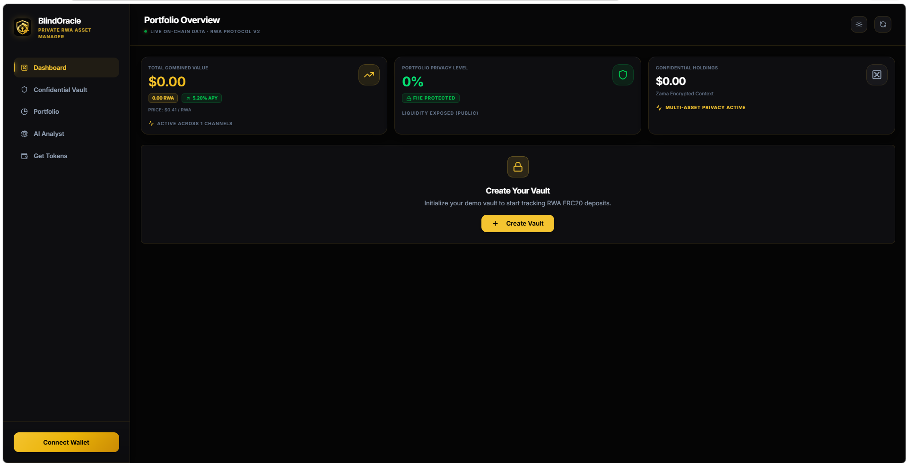

# BlindOracle: Sovereign Institutional Wealth Manager


> **Live Application**: [https://blind-oracle.vercel.app](https://blind-oracle.vercel.app)
> **Video Demo**: [https://x.com/oracle_blindrwa/status/2053535624066441670/video/1](https://x.com/oracle_blindrwa/status/2053535624066441670/video/1)



---

## The Problem: The Transparency Paradox of RWAs
The tokenization of Real World Assets (RWAs) is bringing trillions of dollars of institutional capital on-chain. However, there is a massive roadblock: **Privacy**. 

Institutions, family offices, and sovereign wealth funds **will never** tokenize their treasuries if their entire balance sheet, asset allocations, and yield strategies are broadcast to the public on a transparent blockchain. Competitors could front-run them, and their financial strategies would be entirely exposed.

## The Solution: Zama FHE + AI Intelligence
**BlindOracle** is a privacy-preserving institutional wealth management platform. By leveraging **Zama's Fully Homomorphic Encryption (FHE)**, BlindOracle allows institutions to securely deposit, track, and manage their tokenized assets on-chain, while keeping their exact balances mathematically encrypted and invisible to the public.

To make managing this encrypted wealth seamless, BlindOracle integrates an on-chain **AI Analyst** capable of reading the encrypted state and providing custom, private portfolio insights.

---

## How We Integrated Zama FHE
BlindOracle deeply integrates the Zama protocol across both the smart contract and frontend layers:

1. **BlindOracleFHEVault.sol (Smart Contract)**:
   - Utilizes `TFHE.euint32` types to store institutional RWA balances entirely in ciphertext.
   - Enforces compliance gating, ensuring only authorized KYC'd addresses can interact with the private ledger.
   - Smart contract math is computed natively on encrypted data without ever decrypting it.

2. **@zama-fhe/relayer-sdk (Frontend Integration)**:
   - The React frontend directly imports the Zama SDK to generate secure, encrypted inputs on the client side before they ever touch the network.
   - Transactions to create confidential vaults and shield assets are submitted natively to the Sepolia testnet using `fhevm.createEncryptedInput`.
   - Users securely view an "Encrypted Balance Handle" validating their encrypted data is safely stored on-chain.

---

## Platform Architecture

- **Smart Contracts (Sepolia)**: Solidity 0.8.24 + Zama `fhevm` libraries.
- **Frontend (Vercel)**: React + Vite + wagmi/RainbowKit for Web3 Wallet integration. Features a premium "Sovereign Wealth" dark-mode glassmorphism UI.
- **Oracle API (Render)**: An Express/Node.js backend utilizing `viem` to read live Sepolia state and the `Groq` API (Llama-3.1) to generate deterministic, private portfolio analyses.

---

## Deployed Contracts (Sepolia Testnet)

| Contract | Address | Purpose |
|----------|---------|---------|
| **MockRWAToken** | `0x0a9A09B392f95D8999a1a5a14E09cd378Fc23F78` | Testnet ERC20 representing a fiat-pegged Real World Asset. |
| **BlindOracleVault** | `0xEBe26e87b898152e387C4f18F4C8DA932cbDC29f` | Public demo vault showcasing compliance gating. |
| **BlindOracleFHEVault** | `0x8A18528D7e88C481dB341a9D8eE50E4e8D4aF537` | **Zama-native** vault storing balances in ciphertext. |
| **BlindOracleAnalyst** | `0xC2b2677E092191f96373CA54920fAc16863F92Ed` | Interface for triggering AI portfolio analyses. |

---

## Quick Start (Local Development)

### 1. Compile & Test Smart Contracts
```bash
npm install
npx hardhat compile
npm test
```

### 2. Start the AI Oracle Backend
Requires `.env` with `GROQ_API_KEY` and Sepolia `RPC_URL`.
```bash
cd oracle
npm install
npm start
```

### 3. Start the Frontend
```bash
cd frontend
npm install
npm run dev
```
Open `http://localhost:5173` and connect a Web3 Wallet on the Sepolia network.

---

## Compliance & Limitations
- **KYC Gating**: Both vaults feature `complianceRequired` toggles. When enabled, only allowlisted (KYC'd) addresses can initialize vaults or make deposits.
- **Demo Scope**: For the purposes of this hackathon demo, the public vault interacts with standard ERC20 units. The Confidential Vault effectively demonstrates Zama SDK client-side encryption and encrypted handle generation, simulating the initialization of a completely dark on-chain portfolio.

---

*Built for the Zama Developer Program - Season 2.*
